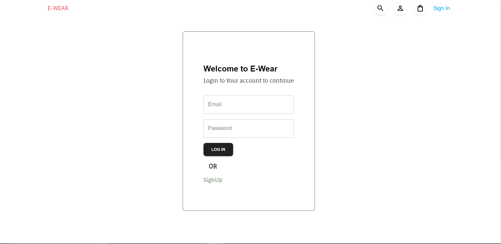
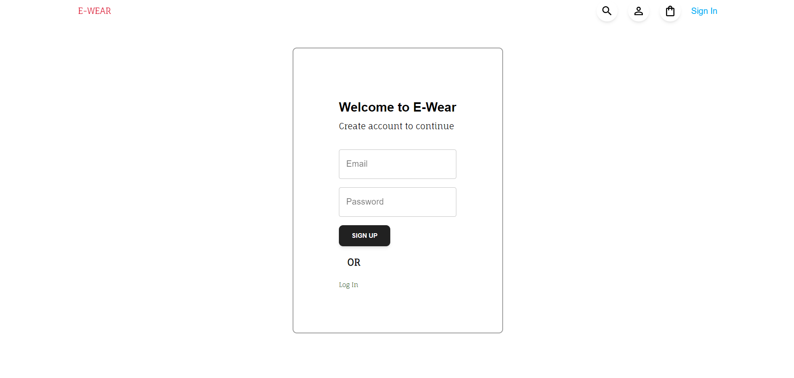
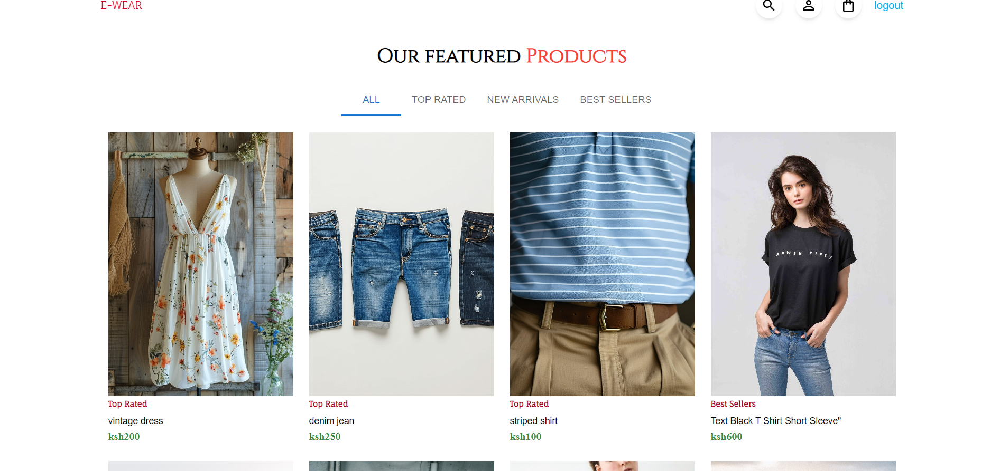

# E-wear

E-waer app for End-of-Specialization Project

## Description

"E-wear app is an eco-friendly e-commerce platform offering stylish second-hand clothing and accessories for conscious fashion enthusiasts."

## Technologies
-   [reactjs](https://reactjs.org/t)
-   [react-redux](https://react-redux.js.org/)
-   [Formik](https://formik.org/)
-   [Material-UI](https://mui.com/)
-   [firebase](https://firebase.google.com/)
-   [tailwind](https://tailwindcss.com/)

## Demo

Screenshots of the UI are visible below : 

### Homepage

### Login page

### signup page

### dashboard

## Usage

Try locally:

* clone the repository

        git clone https://github.com/techiee3041/E-wear.git

* install dependencies

        npm install (or yarn install)

* launch live server

        npm run dev

## Contributing

* You can contribute in various ways:

* Declare bugs or suggest updates via issues

* Improve codebase

## Authors

[Doreen Momanyi](https://github.com/techiee3041)
